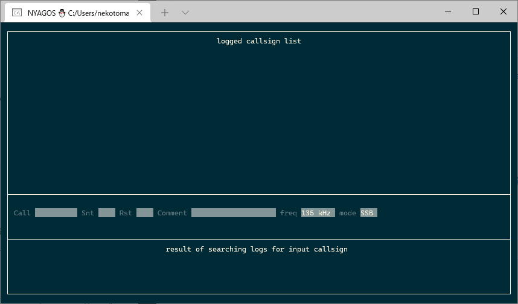

# Amadio
Amadio is AMAteur raDIO logger on Terminal by Golang.

## Installation
If you use Windows, run `chcp 65001` ref: https://github.com/rivo/tview/issues/66 .

## Usage

### Options

|option|descriptions|
| ---- | ---- |
|--help |show the help document|
|--conf ${amadioi.conf}|load the configuration file you specifed.|

## Window Layout
